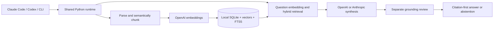

# Mimir-RAG

**Ask your own books and documents, with citations you can inspect.**

Mimir-RAG brings a personal knowledge library to **Claude Code, Codex, and your terminal**. Ingest authorized PDF, UTF-8 text, or Markdown files; retrieve relevant passages; get concise answers and conceptual connections backed by those passages.

- **One engine, two hosts.** Claude Code commands and a Codex skill use the same asynchronous Python CLI and library.
- **Semantic structure.** Chunks stay within pages and sections and favor paragraph and sentence boundaries, with heuristic tags such as `Framework`, `Actionable Advice`, and `Core Theory`.
- **Hybrid retrieval.** Exact vector similarity and SQLite FTS5/BM25 are combined using reciprocal rank fusion.
- **Checked citations.** Every proposed claim needs a known source ID and an exact excerpt, followed by a separate grounding review. Unsupported output produces an explicit abstention.
- **Source-backed concepts.** Inspect concept mentions and co-occurrence, and ask for descriptive connections supported by the text.
- **Safe replacement.** Re-ingestion prepares a complete generation before publishing it; identical input avoids another embedding request.

Your library is stored locally in SQLite. **Inference uses cloud APIs:** embeddings send source text to OpenAI; synthesis and review send retrieved context to OpenAI or Anthropic. Host subscriptions do not automatically supply API keys or pay these API charges.

## How it works



The Python package includes its tokenizer vocabulary, so local parsing and offline tests do not download tokenizer assets. No always-running service, lifecycle hook, or native vector extension is required. The [architecture](docs/architecture.md) defines the detailed data flow and boundaries.

## First use

Install [uv](https://docs.astral.sh/uv/) and use Python 3.11 or newer. Install the shared runtime once; both hosts can then call it:

```bash
uv tool install git+https://github.com/Seungwoo321/mimir-rag.git
mimir-rag --version
mimir-rag doctor
```

`doctor` checks local setup and reports whether keys are present without printing them or calling a provider. It initializes the selected library if necessary. If `mimir-rag` is missing from your `PATH`, run `uv tool update-shell` and open a new shell.

Supply `OPENAI_API_KEY` through your environment or OS secret store. For a Bash or Zsh terminal, this reads it without displaying it or putting its value in shell history:

```bash
printf 'OpenAI API key (hidden): '
read -rs OPENAI_API_KEY
export OPENAI_API_KEY
printf '\n'
```

Start Claude Code or Codex from that shell so it inherits the variable. A host already running in another environment will not acquire it automatically.

Create a small document containing your own example text:

```bash
cat > feedback-notes.md <<'EOF'
---
title: Feedback Notes
author: Example Author
---
# Feedback

**Feedback loop** means using observed outcomes to revise the next action.
**Control theory** studies how systems use feedback to regulate behavior.
EOF

mimir-rag ingest ./feedback-notes.md --rights "Original demonstration text"
mimir-rag ask -- "How are feedback loops and control theory related?"
mimir-rag list
mimir-rag graph
```

`ingest` and `ask` invoke paid APIs when inference is needed. Use these commands only when you intend that processing. `list`, `graph`, and `doctor` work locally without provider calls.

## Claude Code plugin

Register the public marketplace and install the plugin for your user account:

```bash
claude plugin marketplace add https://github.com/Seungwoo321/mimir-rag.git --scope user
claude plugin install mimir-rag@mimir-rag-marketplace --scope user
```

Restart Claude Code, then use its namespaced commands:

```text
/mimir-rag:ingest ./feedback-notes.md --rights "Original demonstration text"
/mimir-rag:ask How are feedback loops and control theory related?
```

Commands pass paths and questions to the shared CLI as literal arguments and preserve the engine's answer or abstention. Relative paths refer to the host's current working directory. For local plugin development, launch `claude --plugin-dir /path/to/mimir-rag`.

## Codex plugin

Install from the repository marketplace:

```bash
codex plugin marketplace add https://github.com/Seungwoo321/mimir-rag.git --ref main
codex plugin add mimir-rag@mimir-rag-marketplace
codex plugin list --marketplace mimir-rag-marketplace --json
```

Restart Codex and explicitly select the plugin's shared skill:

```text
$mimir-rag:mimir-rag Ingest ./feedback-notes.md with rights "Original demonstration text".
$mimir-rag:mimir-rag How are feedback loops and control theory related in my library?
```

Plugin installation and Python runtime installation are separate. Install the CLI in the first-use section before invoking the skill.

### Direct skill installation

For Codex installations using standalone skills instead of plugins:

```bash
git clone https://github.com/Seungwoo321/mimir-rag.git
cd mimir-rag
python3 scripts/install_skill.py
```

This installs only the shared skill into `~/.agents/skills/mimir-rag`. Restart the host and invoke `$mimir-rag`. `--target` selects another skill directory; the installer preserves a differing existing skill instead of overwriting it. Choose either this installation or the plugin to avoid duplicate skill entries.

## Answers and citations

The following is an **illustrative rendering**, not a recorded API result. Actual wording, source spans, and generation IDs depend on the indexed document and accepted model output:

```markdown
- [Feedback Notes, Feedback, lines 5-8](file:///example/feedback-notes.md#lines=5-8&chars=53-213&chunk=illustrative) The notes describe feedback as using observations to revise an action.

Concept mapping:

- [Feedback Notes, Feedback, lines 5-8](file:///example/feedback-notes.md#lines=5-8&chars=53-213&chunk=illustrative) feedback loop ↔ control theory (source-described connection): The notes connect control theory with regulating behavior through feedback.
```

Each factual item starts with a citation rendered from stored metadata. TXT and Markdown citations use decoded-text line spans; PDF citations use **physical page numbers**, which may differ from printed page numbers. Links include character offsets and a generation-specific chunk ID. Unknown authors remain unknown.

Source links point to the original local file. Moving or editing that file does not remove indexed evidence, but the link may no longer resolve to the indexed snapshot. Re-ingest an edited file to update its evidence.

Concept co-occurrence establishes only that terms appear together. A described relationship needs supporting evidence and a positive review. The [prompt contract](docs/prompts.md) defines the exact schemas and review rules.

## CLI and library management

```bash
mimir-rag ingest ./book.pdf --title "Systems Handbook" --author "Example Author"
mimir-rag ask --top-k 8 --json -- "What does the handbook say about feedback?"
mimir-rag list
mimir-rag graph --document-id YOUR_DOCUMENT_ID
mimir-rag delete YOUR_DOCUMENT_ID
```

Use the document ID returned by `ingest` or `list`. JSON answers include `markdown`, `abstained`, `source_ids`, and `reason`. The CLI also accepts literal `/ingest` and `/ask` aliases. Ask exit codes are `0` for an accepted answer, `3` for abstention, and `2` for an actionable error. Passing the entire question after `--` also supports questions starting with a hyphen.

The default library is `$XDG_DATA_HOME/mimir-rag/library.sqlite3`, or `~/.local/share/mimir-rag/library.sqlite3` when `XDG_DATA_HOME` is unset. Select another library with `MIMIR_DB_PATH` or the global `--db` option, placed before the command:

```bash
mimir-rag --db "$HOME/.local/share/mimir-rag-research/library.sqlite3" list
```

- Re-ingesting the same canonical file path updates one document identity. Changed source content, extracted text or citation coordinates, metadata, or chunk settings produce a complete replacement generation.
- A source moved to another path has a new identity; delete the old indexed document if you no longer need it.
- `delete` removes the document's searchable chunks and concept entries. It leaves the original source file in place.
- Changing the embedding model or dimensions requires a new database and re-ingestion. Preserve the old library until you have checked the new one.
- Back up a live library with SQLite's online-backup mechanism or a consistent filesystem snapshot. Recovery details belong to the [playbook](docs/verification.md#operational-recovery).

The immediate data directory must be private. Library capacity defaults to **50,000 chunks** and can be configured up to **150,000** with `MIMIR_MAX_CHUNKS`. Exact dense retrieval scans the corpus in bounded batches with O(N × dimensions) cost; larger libraries require more disk space and increase query latency. Input defaults are 25 MB per file, 500 PDF pages, an 8 MB page content/form-stream budget, and two million extracted characters. Image-only PDFs need external OCR; encrypted or corrupt PDFs are rejected. The [architecture](docs/architecture.md) and [schema](docs/schema.md) define persistence and parser behavior.

## Models and configuration

OpenAI supplies embeddings for both synthesis providers. For Anthropic synthesis and review, retain `OPENAI_API_KEY`, supply `ANTHROPIC_API_KEY` through the same secret-management method, and select the provider:

```bash
export MIMIR_SYNTHESIS_PROVIDER=anthropic
unset MIMIR_SYNTHESIS_MODEL
```

An unset synthesis model selects `claude-haiku-4-5-20251001` for Anthropic. Switching back to `openai` selects the OpenAI default. You can explicitly choose a model compatible with the provider's structured-output API; `MIMIR_VERIFICATION_MODEL` can select another review model from that provider.

| Variable | Default | Purpose |
| --- | --- | --- |
| `OPENAI_API_KEY` | Unset | Required for cloud embeddings and OpenAI synthesis |
| `ANTHROPIC_API_KEY` | Unset | Required for Anthropic synthesis and review |
| `MIMIR_DB_PATH` | XDG data directory | Select the local library |
| `MIMIR_EMBEDDING_MODEL` | `text-embedding-3-small` | Embedding space; changing it requires a new library |
| `MIMIR_EMBEDDING_DIMENSIONS` | `1536` | Embedding dimensions; must match the library |
| `MIMIR_SYNTHESIS_PROVIDER` | `openai` | `openai` or `anthropic` |
| `MIMIR_SYNTHESIS_MODEL` | `gpt-4.1-mini` for OpenAI | Synthesis model; Anthropic default is described above |
| `MIMIR_VERIFICATION_MODEL` | Same as synthesis | Model for the separate grounding review |
| `MIMIR_CHUNK_TARGET_TOKENS` / `MIMIR_CHUNK_MAX_TOKENS` / `MIMIR_CHUNK_OVERLAP_TOKENS` | `450` / `700` / `64` | Require overlap < target ≤ maximum |
| `MIMIR_TOP_K` | `6` | Retrieved passages; `ask --top-k` overrides it |
| `MIMIR_CONTEXT_TOKEN_BUDGET` | `6000` | Serialized evidence, prompts, schemas, and review proposal |
| `MIMIR_MIN_DENSE_SCORE` | `0.25` | Minimum cosine evidence floor; not a confidence probability |
| `MIMIR_MAX_CHUNKS` | `50000` | Library capacity; integer from 1 through 150000 |
| `MIMIR_API_TIMEOUT_SECONDS` / `MIMIR_API_MAX_RETRIES` | `45` / `3` | Bounded provider attempts |

Configuration is read from the invoking process environment. [`.env.example`](.env.example) contains nonsecret examples and is **not automatically loaded**. [Settings](src/mimir_rag/config.py) is the complete reference for names, defaults, and validation. An accepted answer ordinarily uses a question embedding plus separate synthesis and review calls; API billing is separate from host subscriptions.

## Upgrade and uninstall

Update the runtime and the host integration separately:

```bash
uv tool upgrade mimir-rag

claude plugin marketplace update mimir-rag-marketplace
claude plugin update mimir-rag@mimir-rag-marketplace --scope user

codex plugin marketplace upgrade mimir-rag-marketplace
codex plugin add mimir-rag@mimir-rag-marketplace
```

Restart the relevant host after updating. To remove integrations and the CLI:

```bash
claude plugin uninstall mimir-rag@mimir-rag-marketplace --scope user
codex plugin remove mimir-rag@mimir-rag-marketplace
uv tool uninstall mimir-rag
```

Run only the removal commands for installations you use. Uninstalling the host integration or runtime does not delete a library stored in the data directory. A direct skill installation is a separate directory; remove only the `mimir-rag` skill you installed after checking that it contains no changes you want to retain.

## Troubleshooting

| Symptom | What to check |
| --- | --- |
| CLI unavailable | Install the shared runtime, run `uv tool update-shell`, and restart the shell and host |
| Plugin or skill missing | Check host plugin listings, restart the host, and use the namespaced command or skill shown above |
| API key missing or request rejected | Run `doctor` in the host's environment; check credentials, model access, and API billing |
| Answer abstains with exit `3` | Inspect JSON `reason`; ingest relevant material or ask a question supported by the library. Do not fill the gap with uncited facts |
| Context budget exceeded | Narrow the question or adjust the documented retrieval/context settings |
| Embedding-space mismatch | Use a new database for the new model/dimensions and re-ingest |
| PDF has no extractable text | Run authorized external OCR first and ingest its searchable output |
| Private-directory or database-integrity error | Use an owner-only data directory; preserve an existing failing library and follow the recovery playbook |
| Provider timeout or rate limit | Let bounded retries finish, check provider availability, and retry deliberately; an unpublished ingestion replacement leaves committed evidence intact |

The [verification playbook](docs/verification.md) covers failure scenarios and operational recovery.

## Security, privacy, and copyright

Only ingest documents you are authorized to process, including permission for cloud processing when required. A `--rights` note records your declaration; it does not certify permission. The database contains plaintext source passages and vectors, protected by local owner permissions rather than application encryption. Keep documents, databases, keys, and private logs outside Git.

Document instructions are treated as untrusted source content. The engine does not download source URLs, execute document code, or let a model choose arbitrary local files. Exact source IDs and excerpts are checked deterministically; semantic grounding is assessed by a fallible model. A separate review improves grounding but is not a mathematical zero-hallucination guarantee.

Abstractive output, concept mapping, and bounded copying reduce reproduced expression. They do not determine fair use or create a legal exemption. Deleting searchable rows does not promise forensic erasure from WAL files, snapshots, or backups. The [architecture](docs/architecture.md#privacy-copyright-and-recovery) owns the detailed boundaries.

## Development and reference

```bash
git clone https://github.com/Seungwoo321/mimir-rag.git
cd mimir-rag
uv sync --extra dev
uv run mimir-rag --help
```

Follow the [local verification commands](docs/verification.md#local-verification) for lint, formatting, types, synthetic tests, wheel/sdist builds, and manifest validation. Offline tests do not read personal books or call paid endpoints. Intentional live checks require separate credentials and a source you are authorized to process.

| Phase | Artifacts |
| --- | --- |
| 1. Architectural blueprint | [Architecture](docs/architecture.md) defines topology, processing, and privacy; [schema](docs/schema.md) defines persistence and retrieval |
| 2. Complete core codebase | [Configuration](src/mimir_rag/config.py), [ingestion](src/mimir_rag/ingestor.py), [vector store](src/mimir_rag/vector_store.py), [generation](src/mimir_rag/generator.py), and [CLI](src/mimir_rag/main.py) |
| 3. Advanced system prompts | [Exact synthesis and grounding-review prompts](docs/prompts.md), with structured output contracts |
| 4. Verification and edge cases | [Verification playbook](docs/verification.md) for checks, failure modes, and recovery; [tests](tests) for executable offline contracts |

License: [MIT](LICENSE). Bundled tokenizer attribution: [third-party notices](THIRD_PARTY_NOTICES.md).
