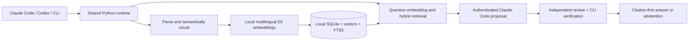

# Mimir-RAG

**Ask your own books and documents, with citations you can inspect.**

Mimir-RAG brings a personal knowledge library to **Claude Code, Codex, and your terminal**. Ingest authorized PDF, UTF-8 text, or Markdown files; retrieve relevant passages; get concise answers and conceptual connections backed by those passages.

- **One engine, two hosts.** Claude Code commands and a Codex skill use the same asynchronous Python CLI and library.
- **Semantic structure.** Chunks stay within pages and sections and favor paragraph and sentence boundaries, with heuristic tags such as `Framework`, `Actionable Advice`, and `Core Theory`.
- **Hybrid retrieval.** Exact vector similarity and SQLite FTS5/BM25 are combined using reciprocal rank fusion.
- **Checked citations.** Every proposed claim needs a known source ID and an exact excerpt, followed by a separate grounding review. Unsupported output produces an explicit abstention.
- **Source-backed concepts.** Inspect concept mentions and co-occurrence, and ask for descriptive connections supported by the text.
- **Safe replacement.** Re-ingestion prepares a complete generation before publishing it; identical input avoids another embedding request.

Your library is stored locally in SQLite. **Embeddings run locally**, without API credentials or source uploads. The first inference operation downloads pinned multilingual E5 model weights. The default answer workflow invokes your installed, authenticated Claude Code twice in separate tool-less contexts for proposal and grounding review, then validates and renders citations. The plugin invokes no OpenAI models. Claude Code supplies answer generation even when the plugin is invoked from Codex; the plugin does not ask the Codex host model to synthesize book answers. Explicitly selected Anthropic API synthesis is optional.

## How it works



The Python package includes its tokenizer vocabulary, so local parsing and offline tests do not download tokenizer assets. No always-running service, lifecycle hook, or native vector extension is required. The [architecture](docs/architecture.md) defines the detailed data flow and boundaries.

## First use

Install [uv](https://docs.astral.sh/uv/) and use Python 3.11 or newer. Install the shared runtime once; both hosts can then call it:

```bash
uv tool install git+https://github.com/Seungwoo321/mimir-rag.git
mimir-rag --version
mimir-rag doctor
```

`doctor` checks local setup and reports whether keys are present without printing them or calling a provider. It initializes the selected library if necessary. If `mimir-rag` is missing from your `PATH`, run `uv tool update-shell` and open a new shell.

No API key is needed for ingestion or retrieval. Default synthesized answers require the `claude` executable and an authenticated Claude Code installation; run `claude` and complete its supported login setup. This uses your existing Claude Code access rather than a separately configured API key. The first operation needs access to download model weights; subsequent inference can use the cached model offline. Set `MIMIR_EMBEDDING_LOCAL_FILES_ONLY=true` to require an existing cache.

Create a small document containing your own example text:

```bash
cat > feedback-notes.md <<'EOF'
---
title: Feedback Notes
author: Example Author
---
# Feedback

**Feedback loop** means using observed outcomes to revise the next action.
**Control theory** studies how systems use feedback to regulate behavior.
EOF

mimir-rag ingest ./feedback-notes.md --rights "Original demonstration text"
mimir-rag ask -- "How are feedback loops and control theory related?"
mimir-rag list
mimir-rag graph
```

`ingest` locally indexes the source. Default `ask` uses two isolated Claude Code calls and returns only a checked answer or abstention. Explicit `retrieve` and `MIMIR_SYNTHESIS_PROVIDER=agent` expose the [manual evidence workflow](#answers-and-citations). `list`, `graph`, and `doctor` inspect local data without synthesis calls.

## Claude Code plugin

Register the public marketplace and install the plugin for your user account:

```bash
claude plugin marketplace add https://github.com/Seungwoo321/mimir-rag.git --scope user
claude plugin install mimir-rag@mimir-rag-marketplace --scope user
```

Restart Claude Code, then use its namespaced commands:

```text
/mimir-rag:ingest ./feedback-notes.md --rights "Original demonstration text"
/mimir-rag:ask How are feedback loops and control theory related?
```

Commands pass paths and questions literally and preserve the shared runtime's checked answer or abstention. Relative paths refer to the host's current working directory. For local plugin development, launch `claude --plugin-dir /path/to/mimir-rag`.

## Codex plugin

Install from the repository marketplace:

```bash
codex plugin marketplace add https://github.com/Seungwoo321/mimir-rag.git --ref main
codex plugin add mimir-rag@mimir-rag-marketplace
codex plugin list --marketplace mimir-rag-marketplace --json
```

Restart Codex and explicitly select the plugin's shared skill:

```text
$mimir-rag:mimir-rag Ingest ./feedback-notes.md with rights "Original demonstration text".
$mimir-rag:mimir-rag How are feedback loops and control theory related in my library?
```

Plugin installation and Python runtime installation are separate. Install the CLI in the first-use section before invoking the skill.

### Direct skill installation

For Codex installations using standalone skills instead of plugins:

```bash
git clone https://github.com/Seungwoo321/mimir-rag.git
cd mimir-rag
python3 scripts/install_skill.py
```

This installs only the shared skill into `~/.agents/skills/mimir-rag`. Restart the host and invoke `$mimir-rag`. `--target` selects another skill directory; the installer preserves a differing existing skill instead of overwriting it. Choose either this installation or the plugin to avoid duplicate skill entries.

## Answers and citations

Default `ask` performs structured synthesis and grounding review through two separate tool-less Claude Code contexts. Source instructions remain untrusted; neither context receives document-selected tools.

For an explicit non-OpenAI agent workflow, set `MIMIR_SYNTHESIS_PROVIDER=agent` or use `retrieve` and follow these stages:

1. `mimir-rag ask --json -- "QUESTION"` retrieves evidence and returns `session_id`, `evidence_hash`, prompts, schemas and payload.
2. A non-OpenAI agent writes a schema-valid proposal containing only claims grounded in that payload.
3. `mimir-rag review-context --session ID --proposal proposal.json --evidence-hash HASH` emits the bound independent review context and proposal hash.
4. A separate non-OpenAI reviewer evaluates every proposed claim and returns the bound review envelope in `review.json`.
5. `mimir-rag verify --session ID --proposal proposal.json --review review.json --evidence-hash HASH --json` validates current evidence and renders accepted Markdown or abstention.

Proposal, review and session files contain private evidence and belong outside source control. The producer must not approve its own proposal. If independent review is unavailable, present retrieved evidence without claiming a verified synthesized answer. The [prompt contract](docs/prompts.md) owns schemas, exact prompts, and integrity boundaries.

The following is an **illustrative rendering**, not a recorded inference result. Actual wording, source spans, and generation IDs depend on the indexed document and accepted model output:

```markdown
- [Feedback Notes, Feedback, lines 5-8](file:///example/feedback-notes.md#lines=5-8&chars=53-213&chunk=illustrative) The notes describe feedback as using observations to revise an action.

Concept mapping:

- [Feedback Notes, Feedback, lines 5-8](file:///example/feedback-notes.md#lines=5-8&chars=53-213&chunk=illustrative) feedback loop ↔ control theory (source-described connection): The notes connect control theory with regulating behavior through feedback.
```

Each factual item starts with a citation rendered from stored metadata. TXT and Markdown citations use decoded-text line spans; PDF citations use **physical page numbers**, which may differ from printed page numbers. Links include character offsets and a generation-specific chunk ID. Unknown authors remain unknown.

Source links point to the original local file. Moving or editing that file does not remove indexed evidence, but the link may no longer resolve to the indexed snapshot. Re-ingest an edited file to update its evidence.

Concept co-occurrence establishes only that terms appear together. A described relationship needs supporting evidence and a positive review. The [prompt contract](docs/prompts.md) defines the exact schemas and review rules.

## CLI and library management

```bash
mimir-rag ingest ./book.pdf --title "Systems Handbook" --author "Example Author"
mimir-rag ask --top-k 8 --json -- "What does the handbook say about feedback?"
mimir-rag list
mimir-rag graph --document-id YOUR_DOCUMENT_ID
mimir-rag delete YOUR_DOCUMENT_ID
```

Use the document ID returned by `ingest` or `list`. Verified JSON answers include `markdown`, `abstained`, `source_ids`, and `reason`; explicit agent-mode ask returns an evidence session until verification. The CLI also accepts literal `/ingest` and `/ask` aliases. Ask exit codes are `0` for an accepted answer or an explicit agent-mode evidence session, `3` for abstention, and `2` for an actionable error. Passing the entire question after `--` also supports questions starting with a hyphen.

The default library is `$XDG_DATA_HOME/mimir-rag/library.sqlite3`, or `~/.local/share/mimir-rag/library.sqlite3` when `XDG_DATA_HOME` is unset. Select another library with `MIMIR_DB_PATH` or the global `--db` option, placed before the command:

```bash
mimir-rag --db "$HOME/.local/share/mimir-rag-research/library.sqlite3" list
```

- Re-ingesting the same canonical file path updates one document identity. Changed source content, extracted text or citation coordinates, metadata, or chunk settings produce a complete replacement generation.
- A source moved to another path has a new identity; delete the old indexed document if you no longer need it.
- `delete` removes the document's searchable chunks and concept entries. It leaves the original source file in place.
- Changing the embedding revision, window/pooling contract or dimensions requires a new database and re-ingestion. Preserve the old library until you have checked the new one.
- Back up a live library with SQLite's online-backup mechanism or a consistent filesystem snapshot. Recovery details belong to the [playbook](docs/verification.md#operational-recovery).

The immediate data directory must be private. Library capacity defaults to **50,000 chunks** and can be configured up to **150,000** with `MIMIR_MAX_CHUNKS`. Exact dense retrieval scans the corpus in bounded batches with O(N × dimensions) cost; larger libraries require more disk space and increase query latency. Input defaults are 25 MB per file, 500 PDF pages, an 8 MB page content/form-stream budget, and two million extracted characters. Image-only PDFs need external OCR; encrypted or corrupt PDFs are rejected. The [architecture](docs/architecture.md) and [schema](docs/schema.md) define persistence and parser behavior.

## Models and configuration

The supported embedding model is `intfloat/multilingual-e5-small`, pinned to revision `614241f622f53c4eeff9890bdc4f31cfecc418b3`, producing 384-dimensional vectors. E5 query/document prefixes, complete tokenizer-window aggregation and normalization define the embedding space. Long chunks are covered in bounded windows rather than silently truncated. Model acquisition downloads weights only; embedding text stays local. Details and primary references are in the [architecture](docs/architecture.md#local-embedding-contract).

| Variable | Default | Purpose |
| --- | --- | --- |
| `MIMIR_DB_PATH` | XDG data directory | Select the local library |
| `MIMIR_EMBEDDING_MODEL` | `intfloat/multilingual-e5-small` | Supported pinned local encoder |
| `MIMIR_EMBEDDING_REVISION` | `614241f622f53c4eeff9890bdc4f31cfecc418b3` | Immutable weights revision |
| `MIMIR_EMBEDDING_DIMENSIONS` | `384` | Must match the encoder and library |
| `MIMIR_EMBEDDING_DEVICE` | `auto` | `auto`, `cpu`, or `mps` |
| `MIMIR_EMBEDDING_WINDOW_TOKENS` | `512` | Bounded encoder input; fingerprinted |
| `MIMIR_EMBEDDING_INFERENCE_BATCH_SIZE` | `32` | Local window inference batch |
| `MIMIR_EMBEDDING_LOCAL_FILES_ONLY` | `false` | Require previously cached model files |
| `MIMIR_SYNTHESIS_PROVIDER` | `claude-code` | Authenticated Claude Code; explicitly `agent` or `anthropic` |
| `MIMIR_CHUNK_TARGET_TOKENS` / `MIMIR_CHUNK_MAX_TOKENS` / `MIMIR_CHUNK_OVERLAP_TOKENS` | `450` / `700` / `64` | Require overlap < target ≤ maximum |
| `MIMIR_TOP_K` | `6` | Retrieved passages; `ask --top-k` overrides |
| `MIMIR_CONTEXT_TOKEN_BUDGET` | `6000` | Evidence, prompts, schemas and review proposal |
| `MIMIR_MIN_DENSE_SCORE` | `0.25` | Cosine floor, not a confidence probability |
| `MIMIR_MAX_CHUNKS` | `50000` | Capacity from 1 through 150000 |

Configuration comes from the invoking process environment. [`.env.example`](.env.example) is not automatically loaded. [Settings](src/mimir_rag/config.py) is the complete validation reference. The bundled chunk-counting tokenizer is a local vocabulary and makes no model calls; its counts are distinct from the E5 encoder window.

Default `claude-code` generation sends selected evidence to Anthropic through your authenticated Claude Code installation. An explicit `agent` workflow must use Claude or another non-OpenAI generator/reviewer; do not synthesize library answers with the Codex host model.

For optional Anthropic API synthesis and separate review, supply `ANTHROPIC_API_KEY` through an environment/OS secret store and set `MIMIR_SYNTHESIS_PROVIDER=anthropic`. Its default model is `claude-haiku-4-5-20251001`; `MIMIR_SYNTHESIS_MODEL` and `MIMIR_VERIFICATION_MODEL` select compatible Anthropic models. This optional mode sends retrieved evidence to Anthropic and has separate API billing; embeddings remain local.

## Upgrade and uninstall

Update the runtime and the host integration separately:

```bash
uv tool upgrade mimir-rag

claude plugin marketplace update mimir-rag-marketplace
claude plugin update mimir-rag@mimir-rag-marketplace --scope user

codex plugin marketplace upgrade mimir-rag-marketplace
codex plugin add mimir-rag@mimir-rag-marketplace
```

Restart the relevant host after updating. To remove integrations and the CLI:

```bash
claude plugin uninstall mimir-rag@mimir-rag-marketplace --scope user
codex plugin remove mimir-rag@mimir-rag-marketplace
uv tool uninstall mimir-rag
```

Run only the removal commands for installations you use. Uninstalling the host integration or runtime does not delete a library stored in the data directory. A direct skill installation is a separate directory; remove only the `mimir-rag` skill you installed after checking that it contains no changes you want to retain.

## Troubleshooting

| Symptom | What to check |
| --- | --- |
| CLI unavailable | Install the shared runtime, run `uv tool update-shell`, and restart the shell and host |
| Plugin or skill missing | Check host plugin listings, restart the host, and use the namespaced command or skill shown above |
| Claude Code unavailable or unauthenticated | Install Claude Code and complete its supported login; ingestion/retrieval remain local and available |
| Model cache unavailable | Allow the initial pinned model download or provide its complete existing cache; offline-only mode cannot acquire missing files |
| Optional Anthropic request rejected | Run `doctor`; check its explicit credentials, model access and API billing |
| Answer abstains with exit `3` | Inspect JSON `reason`; ingest relevant material or ask a question supported by the library. Do not fill the gap with uncited facts |
| Context budget exceeded | Narrow the question or adjust the documented retrieval/context settings |
| Embedding-space mismatch | Use a new database for the new model/dimensions and re-ingest |
| PDF has no extractable text | Run authorized external OCR first and ingest its searchable output |
| Private-directory or database-integrity error | Use an owner-only data directory; preserve an existing failing library and follow the recovery playbook |
| Local inference fails | Check device/cache setup and bounded batch settings; an unpublished replacement leaves committed evidence intact |

The [verification playbook](docs/verification.md) covers failure scenarios and operational recovery.

## Security, privacy, and copyright

Only ingest documents you are authorized to process. Sharing retrieved evidence with a host or optional Anthropic requires any applicable processing permission. A `--rights` note records your declaration; it does not certify permission. The database contains plaintext source passages and vectors, protected by local owner permissions rather than application encryption. Keep documents, databases, keys, and private logs outside Git.

Document instructions are treated as untrusted source content. The engine does not download source URLs, execute document code, or let a model choose arbitrary local files. Exact source IDs and excerpts are checked deterministically; semantic grounding is assessed by a fallible model. A separate review improves grounding but is not a mathematical zero-hallucination guarantee.

Abstractive output, concept mapping, and bounded copying reduce reproduced expression. They do not determine fair use or create a legal exemption. Deleting searchable rows does not promise forensic erasure from WAL files, snapshots, or backups. The [architecture](docs/architecture.md#privacy-copyright-and-recovery) owns the detailed boundaries.

## Development and reference

```bash
git clone https://github.com/Seungwoo321/mimir-rag.git
cd mimir-rag
uv sync --extra dev
uv run mimir-rag --help
```

Follow the [local verification commands](docs/verification.md#local-verification) for lint, formatting, types, synthetic tests, wheel/sdist builds, and manifest validation. Offline tests do not read personal books or call paid endpoints. Genuine local-weight checks need model files and an authorized source; optional Anthropic checks additionally need separate credentials.

| Phase | Artifacts |
| --- | --- |
| 1. Architectural blueprint | [Architecture](docs/architecture.md) defines topology, processing, and privacy; [schema](docs/schema.md) defines persistence and retrieval |
| 2. Complete core codebase | [Configuration](src/mimir_rag/config.py), [ingestion](src/mimir_rag/ingestor.py), [vector store](src/mimir_rag/vector_store.py), [generation](src/mimir_rag/generator.py), and [CLI](src/mimir_rag/main.py) |
| 3. Advanced system prompts | [Exact synthesis and grounding-review prompts](docs/prompts.md), with structured output contracts |
| 4. Verification and edge cases | [Verification playbook](docs/verification.md) for checks, failure modes, and recovery; [tests](tests) for executable offline contracts |

License: [MIT](LICENSE). Bundled tokenizer attribution: [third-party notices](THIRD_PARTY_NOTICES.md).
