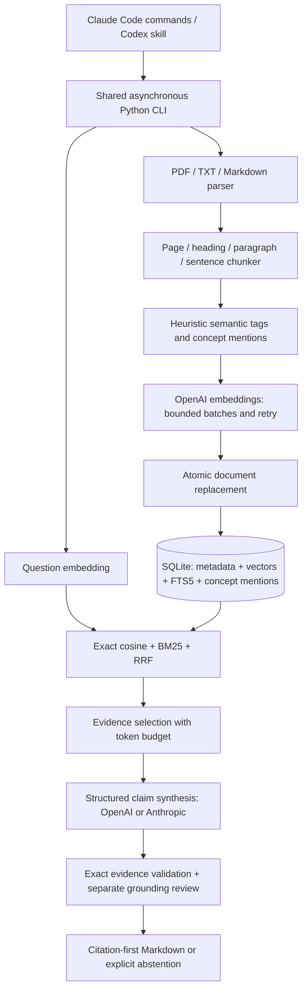

# Mimir-RAG architecture

## Contract and scope

Mimir-RAG is a Python 3.11+ local personal-library engine distributed as a Claude Code plugin and a Codex plugin/skill. Both hosts call the same CLI. PDF, UTF-8 text, and Markdown are supported. Cloud embedding and synthesis calls transmit source text to the configured providers; local storage does not imply offline inference. The engine never downloads URLs, follows document instructions, executes source content, or reads arbitrary files on behalf of a model.

The service boundary is a single-user, single-machine library with a configurable maximum of 50,000 chunks. SQLite owns all durable data. Exact cosine search uses NumPy in bounded batches and has O(N × dimensions) cost. SQLite FTS5 provides BM25; reciprocal rank fusion (RRF) merges ranks rather than adding incomparable scores. This avoids an unmaintained sqlite-vss dependency and native extension loading. An approximate index is outside this bounded contract.



## Data authority

`documents` holds a stable ID derived only from the canonical source path. Raw file hash, metadata, ingestion signature, rights note, source URI, and update timestamp are payload fields. A generation hash covers raw content, the indexed extracted text and its page/section/line/character coordinates, metadata, and chunker settings. The timestamp is not part of identity or generation. A changed extraction creates a replacement generation even when source bytes are unchanged. Chunk IDs incorporate generation and ordinal so a stale source reference cannot silently refer to different text. The [extraction identity decision](decisions/0001-extracted-source-identity.md) records the rationale.

`chunks` holds text, title, author, heading, physical PDF page or UTF-8 decoded-text line span, normalized-text character span, token count, semantic tags, concept mentions, and a normalized little-endian float32 embedding. `chunks_fts` indexes text/title/section/concepts. SQLite triggers synchronize its content. `concept_mentions` anchors normalized labels to chunks. A concept graph contains source-backed `mentions` edges and explicitly marked co-occurrence edges; it does not infer causal relationships.

`library_meta` stores schema version and embedding provider/model/dimension/encoding fingerprint. Every write and dense query validates this fingerprint. A model or dimension change requires a new database and re-ingestion; matching dimensionality alone is insufficient. Chunk configuration is a document ingestion signature, not an embedding-space identity. An unsupported schema version, corrupt database, or missing metadata in a populated database causes an actionable error without automatic overwrite or downgrade.

Example metadata payload:

```json
{
  "title": "Systems Handbook",
  "author": "Example Author",
  "section": "Chapter 2 / Feedback",
  "page": 17,
  "line_start": null,
  "line_end": null,
  "char_start": 80,
  "char_end": 720,
  "tags": ["Core Theory", "Framework"],
  "concepts": ["feedback loop", "control theory"],
  "metadata_origin": "user override / PDF metadata / heading heuristic",
  "rights": "user-supplied permission or license note"
}
```

Titles and authors are explicit overrides or parser metadata; unknown author stays unknown. Heading and concept heuristics are labeled as heuristic. Physical PDF page numbers are never represented as printed page numbers. Text offsets refer to the extracted normalized page or decoded text, not PDF bytes.

## Ingestion lifecycle

The parser bounds file size, page count, extracted text, and PDF content-stream size. Parsing and hashing consume the same immutable byte snapshot outside the event loop. The declared PDF fonts dependency decodes embedded CFF Type1 character maps. Encrypted and scanned PDFs fail with actionable errors. Chunks stay inside page and section boundaries, preserve source offsets, favor semantic boundaries, and use token limits only to divide oversized sentences. Tail overlap is token bounded and stays within the same provenance unit. Empty or unsupported documents fail before provider calls.

All embeddings are computed and validated before one `BEGIN IMMEDIATE` document-replacement transaction. The transaction checks the fingerprint, document generation, chunk capacity, and vector validity. Failure and cancellation observed before commit leave the previous document searchable. A completed commit is the operation's linearization point. Repeating an identical ingestion is a no-op. Concurrent same-document writes serialize through SQLite; each committed generation is complete, and readers use a consistent snapshot. WAL, foreign keys, busy timeout, permissions, and bounded lock waits are mandatory.

## Retrieval and synthesis

An empty library produces a deterministic abstention before any provider call or credential requirement. The retriever parameterizes SQL, safely tokenizes FTS input, bounds top-k, scans normalized vectors in batches, and rejects nonfinite or zero-norm vectors. Dense and lexical candidates are independently ranked and fused using RRF with deterministic tie-breaking. An absolute cosine evidence floor and the independent reviewer control weak matches; an RRF rank is not a confidence probability.

The generator passes retrieved evidence as untrusted JSON under fixed system instructions. Structured output contains an answerability flag, atomic claims with evidence IDs and exact supporting excerpts, and source-backed conceptual connections. The application validates IDs, exact substrings, limits, and graph references before a separate reviewer call. The reviewer cannot supply new prose. Any unsupported claim, malformed output, incomplete coverage, or review failure produces an explicit abstention. Citation labels and links are rendered from stored metadata, never from model-provided URLs or title strings.

Exact references can be validated deterministically; semantic entailment is assessed by a fallible model. The system therefore makes no mathematical zero-hallucination guarantee. The review is a separate call and role, not a request to expose chain-of-thought. Validated claims and short review verdicts are sufficient.

## Privacy, copyright, and recovery

Only user-authorized documents are ingested. A rights note records the user's declared provenance without certifying it. The local database includes source text; it is protected by owner-only directory/file permissions and is not an encrypted vault. Secrets stay in environment variables and never appear in logs or documents. HTTPS provider endpoints are fixed. Providers receive only embedding inputs or the selected context, with OpenAI response storage disabled. Every HTTP attempt has an overall deadline and a 16 MiB decoded-response limit. Credential headers are validated before transmission; malformed responses and transport failures become secret-free provider errors.

Public output is abstractive and bounded, with deterministic checks against extended verbatim copying. A concept graph reduces reproduced expression but is not a legal exemption. No fixed word threshold guarantees fair use, and local possession does not establish cloud-processing or publication rights. The code and synthetic tests are public; personal documents, vectors, environment files, and local logs are excluded from Git. Deleting a document removes its chunks, FTS entries, and concept mentions transactionally; SQLite/WAL deletion is not forensic erasure.

## Host packaging and verification

`.claude-plugin/plugin.json` and its marketplace expose `/mimir-rag:ingest` and `/mimir-rag:ask`. `.codex-plugin/plugin.json` exposes the shared skill; direct skill installation remains supported. Both hosts run the installed `mimir-rag` CLI or the plugin-root launch script. Host instructions preserve query text as an argument and never interpolate it as shell code.

Local verification covers parsing and provenance, atomic ingestion and rollback, hybrid ranking, incompatible vectors, citation injection and unsupported claims, provider retries, graph anchoring, CLI dispatch, manifests, wheel/sdist, lint, and types. Remote CI is not required for locally reproducible checks. Live API verification is distinct from offline contract tests and requires credentials and an intentional provider call.

## Primary references

- [SQLite FTS5 and BM25](https://www.sqlite.org/fts5.html)
- [sqlite-vss maintenance status](https://github.com/asg017/sqlite-vss)
- [OpenAI embedding limits and dimensions](https://developers.openai.com/api/docs/guides/embeddings)
- [OpenAI structured outputs](https://developers.openai.com/api/docs/guides/structured-outputs)
- [Anthropic embedding-provider boundary](https://platform.claude.com/docs/en/build-with-claude/embeddings)
- [pypdf extraction limitations](https://pypdf.readthedocs.io/en/stable/user/extract-text.html)
- [Claude Code plugin manifest](https://code.claude.com/docs/en/plugins-reference)
- [OpenAI plugin packaging](https://developers.openai.com/plugins/build/plugins)
- [Copyright Office: ideas versus expression](https://www.copyright.gov/circs/circ33.pdf)
- [Copyright Office: fair use](https://www.copyright.gov/fair-use/)
